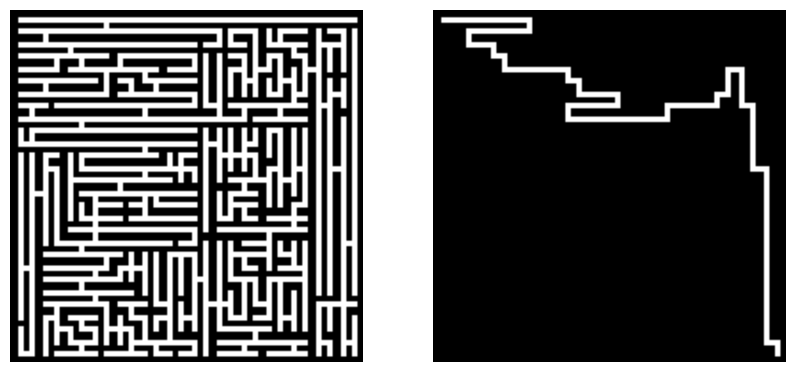
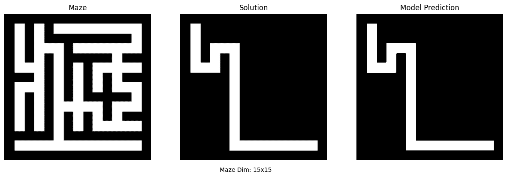
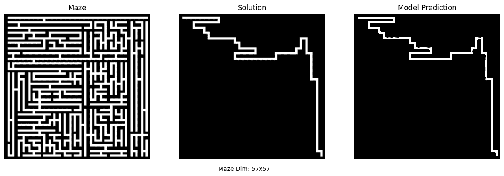
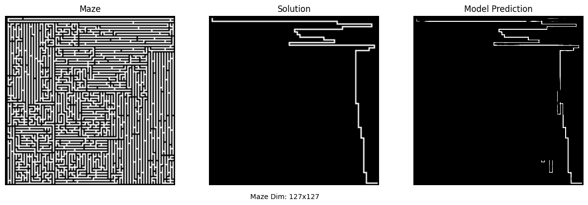

# Deep Maze Solver

Inspired by this [Twitter Post](https://twitter.com/ArnaudPannatier/status/1762864347397628396), which stated that diffusion models could be used to solve algorithmic tasks like solving mazes. Intrigued by this post, I was curious to replicate this work at least on a smaller scale.

Please refer to this [blog post](https://dinesh-gdk.github.io/deep/learning/2024/04/07/deep-maze-solver.html) to see the thought process.

## Aim
The aim is to build a convolutional neural network(CNN) that can solve mazes using supervised learning. Given a maze image, the CNN has to find the path from the top left corner of the maze to the bottom right corner. We are using PyTorch for this task.

## Dataset
Since creating and solving mazes is deterministic, we have an infinite dataset glitch. We are going to create mazes and solutions on the fly!

To create a maze I’m using the **Recursive Division algorithm**, and to solve it, I’m using good old **Depth-first Search**. The dataset generated will only contain mazes of sizes from `5x5` to `127x127`. Here `nxn` means the number of blocks horizontally and vertically. We will resize the mazes to create an image of size `128x128` using nearest neighbor interpolation. 

The goal is to connect the top left corner of the maze to the bottom right corner of the maze. There is only one path that connects any two points in our maze.

The input will be the maze and the labels will be the solved maze. We can simplify the format of the dataset so the network can learn and predict just the solution and not worry about rendering the borders and other structures.

Here is a sample input and label

<p align="center">
  </img>
</p>

## Model
We are going to use regular **U-Net** to train the model

## Quick Start
You need **Python** and a virtual environment

Install dependencies
```bash
pip3 install -r requirements.txt
```

To train the model set the parameters in the `train.py` file and run the script
```bash
python3 train.py
```

The models will be stored as artifacts by `mlflow`, You can open `mlflow` dashboard using the below command
```bash
mlflow server --host 127.0.0.1 --port 8080 --backend-store-uri sqlite:///mlflow.db
```

The models can be found in `mlruns/0/<-id->/artifacts` directory

To run and solve mazes you can use the inference script
```bash
python3 -m <model-path> -s <maze-size> -o <output-path>
```

## Result
Here are some sample results

<p align="center">
  </img>
</p>

<p align="center">
  </img>
</p>

<p align="center">
  </img>
</p>

The model performs well for small and medium size mazes, but it is off a bit for larger mazes. I think this can be solved using a U-Net with a bigger size and using more data to train.

## References
Shoutout to this wonderful repo for providing the [U-Net code](https://github.com/LeeJunHyun/Image_Segmentation).